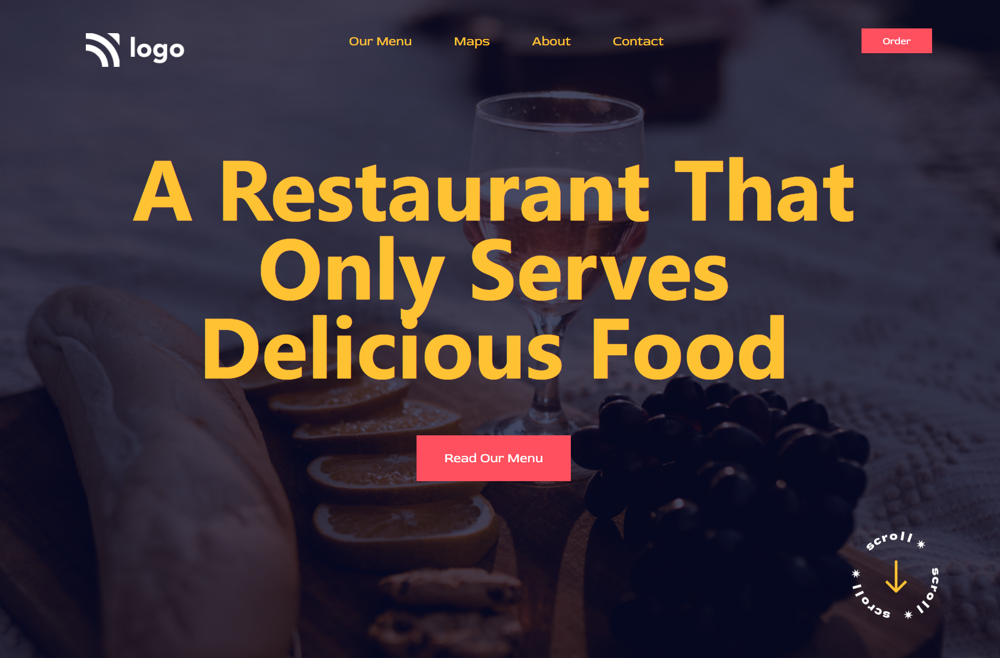

# Project 2

This project required basic HTML & CSS. Lending colour to the background image was a relatively new concept. It was achieved using pseudo-selector `::before` on the body

 

 

## Scroll Image
 

The scroll image was given the property `position:fixed`

## Nav List
 

The nav items were given the property `position:absolute`

